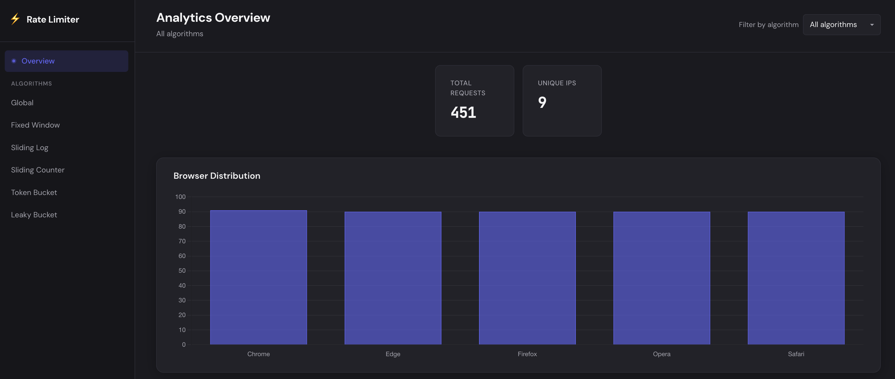
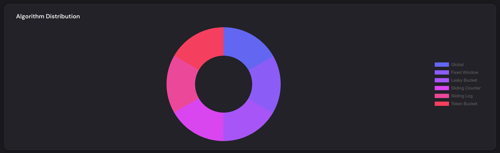
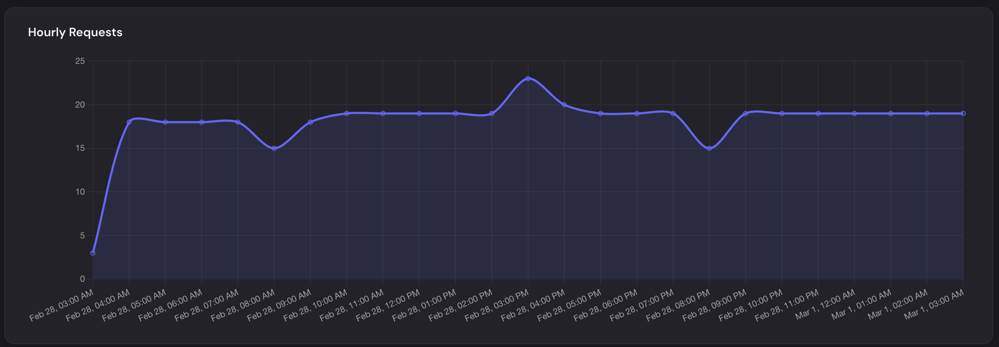

# Rate Limiter Analytics

A production-ready **rate limiting** implementation with multiple algorithms (Fixed Window, Sliding Log, Sliding Counter, Token Bucket, Leaky Bucket), request logging, and an **analytics dashboard** to visualize traffic by browser, algorithm, and time.

---

## Table of Contents

- [Purpose](#purpose)
- [Tech Stack](#tech-stack)
- [Features](#features)
- [API Reference](#api-reference)
- [Analytics Dashboard](#analytics-dashboard)
- [Project Structure](#project-structure)
- [Getting Started](#getting-started)
- [Environment Variables](#environment-variables)
- [Screenshots](#screenshots)

---

## Purpose

This project demonstrates and provides:

1. **Rate limiting** — Protect APIs from abuse using five classic algorithms, each with different trade-offs (accuracy, memory, burst handling).
2. **Request analytics** — Log every request (IP, browser, route, algorithm, status, response time) to PostgreSQL for reporting.
3. **Dashboard** — A single-page UI to view total requests, unique IPs, browser distribution, algorithm distribution, and hourly request trends, with optional filter by algorithm.

Use it as a reference implementation for adding rate limiting and analytics to Node.js APIs, or as a base for internal dashboards.

---

## Tech Stack

| Layer        | Technology |
|-------------|------------|
| **Runtime** | Node.js 20 |
| **Language**| JavaScript (CommonJS) |
| **Framework** | Express 5 |
| **Database** | PostgreSQL 16 (with Knex.js for migrations) |
| **Cache**   | Redis 7 (for rate-limit counters) |
| **Dashboard** | Vanilla JS, Chart.js, CSS |
| **Security** | Helmet, CORS, compression |
| **Dev**     | Nodemon, Knex CLI |
| **Deploy**  | Docker, Docker Compose (multi-container) |

---

## Features

### Rate limiting algorithms

| Algorithm | Route | Description |
|-----------|--------|-------------|
| **Fixed Window** | `GET /api/fixed` | Counts requests in fixed time windows (e.g. per minute). Simple; can allow bursts at window boundaries. |
| **Sliding Log** | `GET /api/sliding-log` | Stores timestamp of each request; precise but memory-heavy. |
| **Sliding Counter** | `GET /api/sliding-counter` | Hybrid: approximates sliding window with two fixed windows. Good balance of accuracy and memory. |
| **Token Bucket** | `GET /api/token-bucket` | Tokens refill at a rate; allows bursts up to bucket capacity. |
| **Leaky Bucket** | `GET /api/leaky-bucket` | Requests leave the “bucket” at a steady rate; smooths traffic. |

- All algorithm endpoints are **logged** (IP, browser, OS, route, algorithm, status, response time) for analytics.
- A **global rate limiter** (Redis) applies to `/api/*` routes (configurable limit/window).

### Analytics dashboard

- **KPIs:** Total requests, unique IPs.
- **Charts:** Browser distribution (bar), algorithm distribution (doughnut), hourly requests (line).
- **Filter:** Dropdown to filter all metrics by algorithm.
- **Algorithm-specific view:** Navigate to `/dashboard/algorithm/<name>` (e.g. `/dashboard/algorithm/token-bucket`) to see metrics for that algorithm only.
- **Responsive layout**, loading/error states, and clear error messages if the server or DB is unavailable.

### Other

- **Health check:** `GET /health` for load balancers and Docker.
- **Request ID** and **logging** middlewares.
- **Seeded dummy data** on first migration (multiple browsers × algorithms) for demo charts.
- **Docker:** Single-command run with app + PostgreSQL + Redis; env from `.env`.

---

## API Reference

Base URL: `http://localhost:3000` (or your `PORT`).

### Health

| Method | Endpoint | Description |
|--------|----------|-------------|
| `GET` | `/health` | Returns `{ status: "OK", request_id: "<uuid>" }`. |

### Rate-limited APIs (under `/api`)

Each endpoint uses the algorithm in the route name and returns `429` when the limit is exceeded.

| Method | Endpoint | Algorithm | Success (200) | Rate limited (429) |
|--------|----------|-----------|----------------|--------------------|
| `GET` | `/api/fixed` | Fixed Window | `{ "message": "Fixed Window Success" }` | `{ "message": "Rate limit exceeded" }` |
| `GET` | `/api/sliding-log` | Sliding Log | `{ "message": "Sliding Log Success" }` | same |
| `GET` | `/api/sliding-counter` | Sliding Counter | `{ "message": "Sliding Counter Success" }` | same |
| `GET` | `/api/token-bucket` | Token Bucket | `{ "message": "Token Bucket Success" }` | same |
| `GET` | `/api/leaky-bucket` | Leaky Bucket | `{ "message": "Leaky Bucket Success" }` | same |

### Analytics API (under `/analytics`)

All analytics endpoints return JSON. Optional query: `?algorithm=<name>` to filter by algorithm (e.g. `fixed`, `token-bucket`).

| Method | Endpoint | Description |
|--------|----------|-------------|
| `GET` | `/analytics/ping` | No DB. Returns `{ "ok": true }`. Use to check server reachability. |
| `GET` | `/analytics/overall` | `{ "total_requests": "<count>", "unique_ips": "<count>" }`. |
| `GET` | `/analytics/browsers` | `[{ "browser": "<name>", "total": <n> }, ...]`. |
| `GET` | `/analytics/algorithms` | `[{ "algorithm": "<name>", "total": <n> }, ...]`. |
| `GET` | `/analytics/hourly` | `[{ "hour": "<ISO date>", "total": <n> }, ...]`. |
| `GET` | `/analytics/algorithm/:name` | Full stats for one algorithm: `{ "overall", "browsers", "hourly", "algorithm" }`. |

---

## Analytics Dashboard

- **URL:** `http://localhost:3000/dashboard` (or `http://localhost:3000/` which redirects to dashboard).
- **Algorithm-specific:** `http://localhost:3000/dashboard/algorithm/<name>` (e.g. `token-bucket`, `fixed`).

The dashboard shows:

- **Total requests** and **Unique IPs** (cards).
- **Browser distribution** (bar chart).
- **Algorithm distribution** (doughnut chart; hidden on algorithm-specific view).
- **Hourly requests** (line chart).
- **Filter by algorithm** (dropdown; updates URL and all charts).

---

## Project Structure

```
rate-limiter-analytics/
├── public/
│   └── dashboard/          # Dashboard SPA (HTML, CSS, JS, Chart.js)
├── src/
│   ├── config/             # DB, Redis, logger
│   ├── controllers/        # Analytics controller
│   ├── database/
│   │   └── migrations/    # Knex migrations + seed
│   ├── middlewares/        # requestId, logger, rate limiter, analytics
│   ├── rateLimiters/       # Fixed, Sliding Log/Counter, Token/Leaky Bucket
│   ├── routes/             # limiterRoutes, analyticsRoutes
│   ├── services/           # Analytics DB queries, analytics.service (save log)
│   └── app.js
├── scripts/
├── .env.example
├── docker-compose.yml
├── Dockerfile
├── knexfile.js
├── package.json
└── server.js
```

---

## Getting Started

### Prerequisites

- **Node.js** 20+ (for local run)
- **PostgreSQL** 16 and **Redis** 7 (for local run)
- **Docker** and **Docker Compose** (for containerized run)

### Option 1: Run with Docker (recommended)

Runs app + PostgreSQL + Redis; config from `.env`.

```bash
# Clone and enter project
git clone <repo-url>
cd rate-limiter-analytics

# Copy env and edit if needed (PORT, DB_USER, DB_PASSWORD, DB_NAME, etc.)
cp .env.example .env

# Build and start (migrations run automatically on app start)
docker compose up -d

# Optional: rebuild after code changes
docker compose up -d --build
```

- **App:** http://localhost:3000 (or `PORT` from `.env`)
- **Dashboard:** http://localhost:3000/dashboard
- **Stop:** `docker compose down`

### Option 2: Run locally

```bash
# Install dependencies
npm install

# Copy env and set DB/Redis to your local instances
cp .env.example .env
# Edit .env: DB_HOST, DB_PORT, DB_USER, DB_PASSWORD, DB_NAME, REDIS_HOST, REDIS_PORT

# Run migrations (and seed if table is empty)
npm run migrate

# Start server
npm run dev
```

- **App:** http://localhost:3000
- **Dashboard:** http://localhost:3000/dashboard

---

## Environment Variables

Copy `.env.example` to `.env` and adjust as needed.

| Variable | Description | Default (example) |
|----------|-------------|--------------------|
| `PORT` | HTTP server port | `3000` |
| `NODE_ENV` | `development` or `production` | — |
| `DB_HOST` | PostgreSQL host | `localhost` (Docker: `postgres`) |
| `DB_PORT` | PostgreSQL port | `5432` |
| `DB_USER` | PostgreSQL user | `postgres` |
| `DB_PASSWORD` | PostgreSQL password | — |
| `DB_NAME` | PostgreSQL database name | `rate_limiters_db` |
| `REDIS_HOST` | Redis host | `localhost` (Docker: `redis`) |
| `REDIS_PORT` | Redis port | `6379` |
| `REDIS_URL` | Redis URL (for rate limiters) | `redis://localhost:6379` |

Docker Compose reads `PORT`, `DB_USER`, `DB_PASSWORD`, `DB_NAME`, `DB_PORT`, `REDIS_PORT` from `.env` for port mapping and service config.

---

## Screenshots

### Dashboard overview

Analytics dashboard with sidebar, KPIs (Total Requests, Unique IPs), filter dropdown, and Browser Distribution chart.



### Analytics charts

Full-width charts: Browser Distribution, Algorithm Distribution, and Hourly Requests.



### Algorithm-specific view

Metrics filtered by a single algorithm (e.g. Token Bucket) at `/dashboard/algorithm/token-bucket`.



---

## License

ISC.
